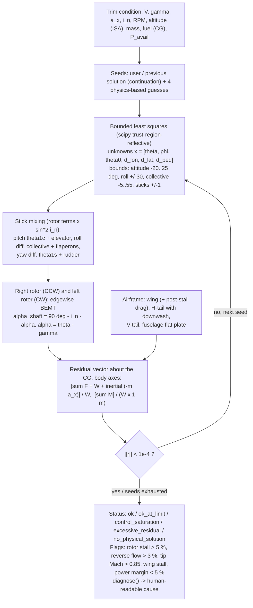
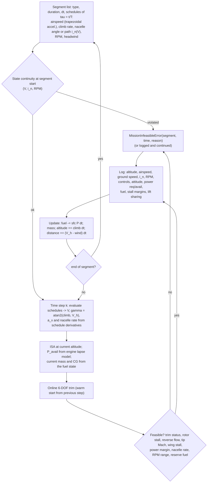

# Tiltrotor Milestone 2 — Algorithms and Logic Flow (report Section 2)

All modules are in `src/m2/`; the aircraft is defined once in `aircraft_input_m2.py`, which builds on the
Milestone 1 configuration (`src/aircraft_input.py`). The Milestone 1 solver (`src/bemt.py`) is unchanged and is
reproduced exactly by the edgewise solver when the edgewise velocity and cyclic pitch are zero.

---

## 2.1 Edgewise-flight performance estimator (`edgewise_bemt.run_edgewise_bemt`)

```mermaid
flowchart TD
    IN["Inputs: rotor geometry (R, B, chord(r), twist(r), cut-out), airfoil(r),<br/>V, alpha_shaft, Omega, theta0, theta1c, theta1s, rho, a,<br/>nacelle angle i_n, hub position from CG, rotation CCW/CW"] --> GRID
    GRID["Grid: n_r radial stations (cut-out..R) x n_psi azimuths<br/>(psi from aft, in the direction of rotation)"] --> KIN
    KIN["Blade kinematics (rigid disk, beta = 0)<br/>theta(r,psi) = twist + theta0 + theta1c cos psi + theta1s sin psi<br/>U_T = Omega r + V cos(alpha_s) sin psi<br/>mu = V cos(alpha_s)/(Omega R), lambda_c = V sin(alpha_s)/(Omega R)"] --> CT0
    CT0["Initial C_T guess"] --> GL
    GL["Rotor-level Glauert momentum:<br/>lambda_iG = C_T / (2 sqrt(mu^2 + (lambda_c + lambda_iG)^2))<br/>K = (4/3 mu/lambda_G) / (1.2 + mu/lambda_G)"] --> ANN
    ANN["Annular momentum with Prandtl tip loss, all stations at once:<br/>mean over psi of dT_BET(r) = 4 pi r rho F v0 sqrt(V_x^2 + (V_c + v0)^2)<br/>(bracket scan + bisection; identical to M1 when mu = 0)"] --> INFL
    INFL["Nonuniform inflow: v_i(r,psi) = v0(r) [1 + K (r/R) cos psi]<br/>U_P = V sin(alpha_s) + v_i"] --> RF
    RF{"U_T < 0 ?<br/>reverse flow"} -- yes --> RFX["alpha = -(theta + phi), in-plane force sign reversed"]
    RF -- no --> NRM["alpha = theta - phi"]
    RFX --> AERO
    NRM --> AERO
    AERO["Sectional aerodynamics: Cl, Cd (stall flag at 14 deg, Cl clipped)<br/>Prandtl-Glauert on Cl, frozen at M = 0.7<br/>dL, dD -> dT, dF_inplane (B blades)"] --> INT
    INT["Rotor-cycle integration: trapezoid in r, mean over psi<br/>T, Q, H, Y, hub moments Mx, My (rigid hub)"] --> CONV
    CONV{"|C_T,new - C_T| < tol ?"} -- no --> GL
    CONV -- yes --> MIR
    MIR["CW rotor: mirror Y, Mx, torque reaction"] --> TRF
    TRF["Shaft -> body rotation (i_n), moment transfer to the CG:<br/>F_body = R_sb F, M_cg = R_sb M_hub + r_hub x F_body"] --> OUT
    OUT["Outputs: 6 body loads, P, C_T, C_Q, sectional dT/dr(r,psi), U_T, alpha, Mach,<br/>reverse-flow area, stalled loaded area, stall margin, advancing-tip Mach"]
```

---

## 2.2 Trim solver (`trim_6dof.trim_6dof`)

Convergence check: Euclidean norm of the normalized residual below 1e-4 (|F| ≲ 7 N, |M| ≲ 7 N·m at 7.2 t).
A converged root with an unknown on its bound is flagged; a non-converged solution with an active bound is a
control-authority failure; otherwise the residual level separates numerical stagnation from physical
infeasibility.

---

## 2.3 Mission Planner v2 (`mission_v2.MissionPlannerV2`)

Trim data come from an online solution at every step (no lookup table); the conversion path used in the
schedules is chosen from the Section 7 corridor map (`CONVERSION_PATH`, `RECONVERSION_PATH` in the config).
